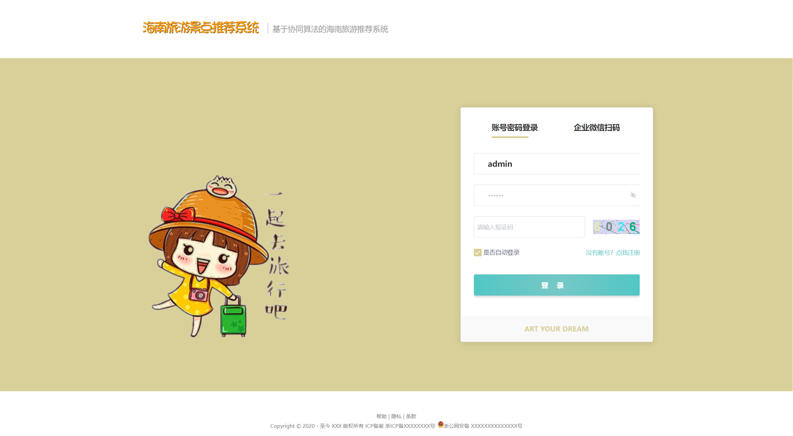
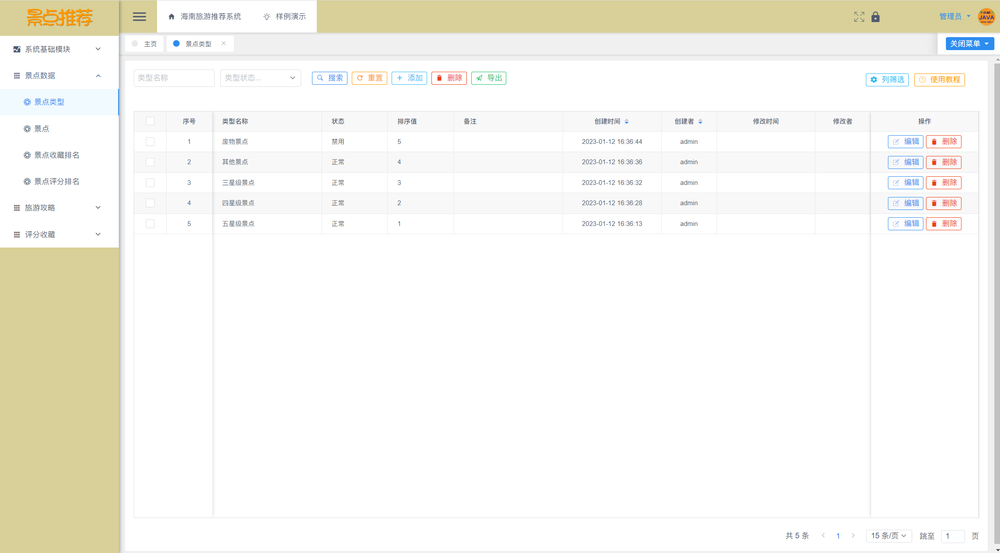
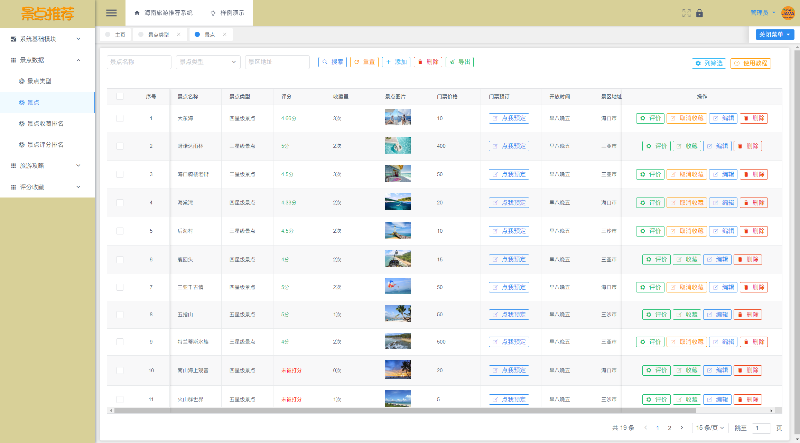
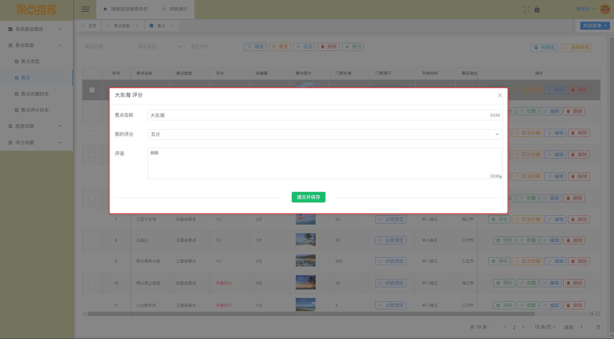
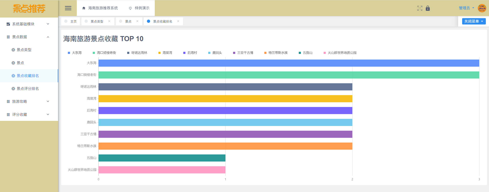
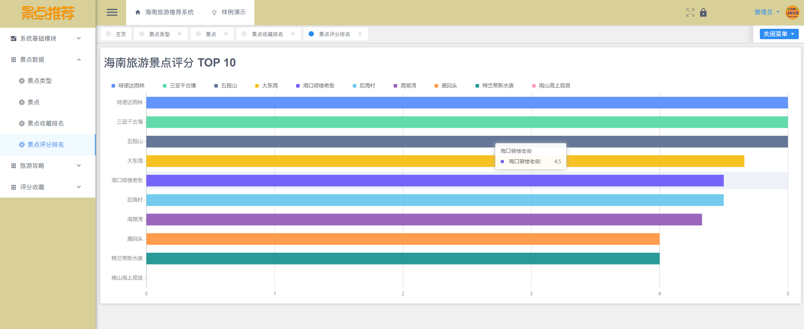
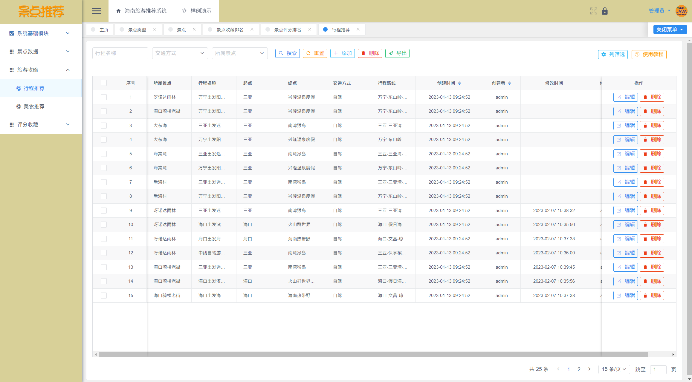
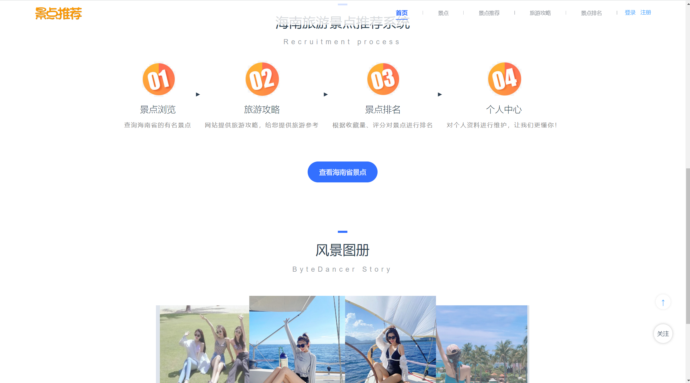
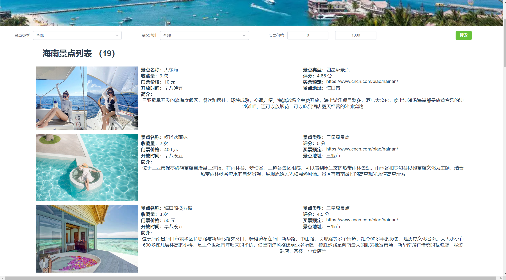
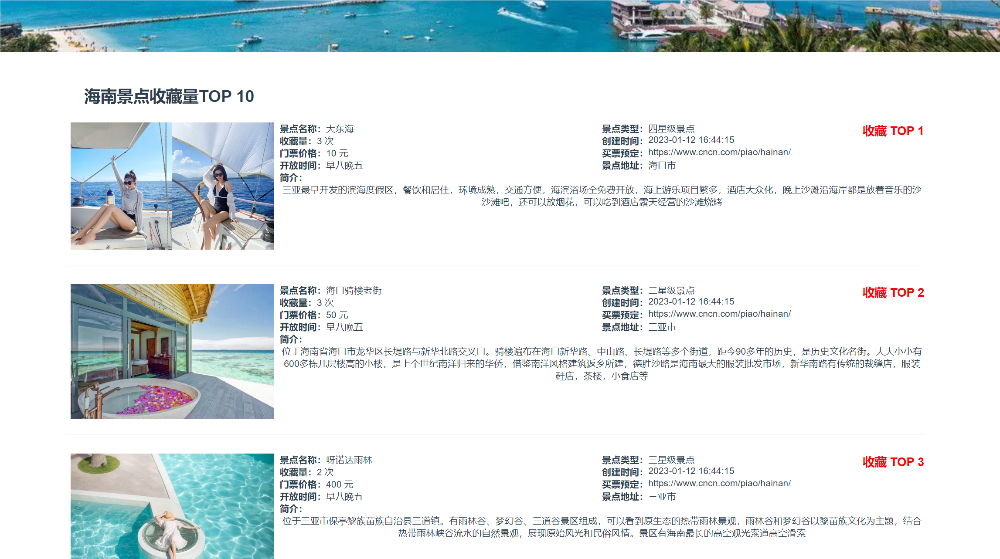

# **海南旅游推荐系统**

## 软件简介

基于Vue+SpringBoot+MySQL的海南旅游推荐系统，基于协同推荐算法，包括用户网页和管理后台，包含景点类型模块、旅游景点模块、行程推荐模块、美食推荐模块、景点排名模块，还包含系统自带的用户管理、部门管理、角色管理、菜单管理、日志管理、数据字典管理、文件管理、图表展示等基础模块，天然气工程运维系统基于角色的访问控制，给景点管理员、游客使用，可将权限精确到按钮级别，您可以自定义角色并分配权限，系统适合设计精确的权限约束需求。。

| 项目交流 | https://bbs.csdn.net/topics/617189787 |
| -------- | ------------------------------------- |

## 项目技术

本资源仅供个人学习使用，如需获取源码请自助下载，谢谢配合。

前端： Node.js 18，Vue 2.7.10。

后端：JDK 17，Maven 3.6，Spring Boot 3.1.0，mybatis-plus 3.5.3.1。

数据库：MySQL 8.0.33，Redis 5.0.14。

## 系统截图

下面是系统截图，相信聪明的读者都能看懂！

## 免责声明

- 本项目仅供个人学习使用，遵循 GPL-3.0 协议，**商用授权请联系作者，否则后果自负**。
- 作者拥有本软件构建后的应用系统全部内容所有权及独立的知识产权。
- 如有问题，欢迎在仓库 Issue 留言，看到后会第一时间回复。相关意见会酌情考虑，但没有一定被采纳的承诺或保证。

下载本系统代码的用户，**必须同意以下内容，否则请勿下载**！

1. 出于自愿而使用/开发本软件，了解使用本软件的风险，且同意自己承担使用本软件的风险。
2. 利用本软件构建的网站的任何信息内容以及导致的任何版权纠纷和法律争议及后果和作者无关，作者对此不承担任何责任。
3. 在任何情况下，对于因使用或无法使用本软件而导致的任何难以合理预估的损失（包括但不仅限于商业利润损失、业务中断与业务信息丢失），作者概不承担任何责任。
4. 必须了解使用本软件的风险，作者不承诺提供一对一的技术支持、使用担保，也不承担任何因本软件而产生的难以预料的问题的相关责任。
